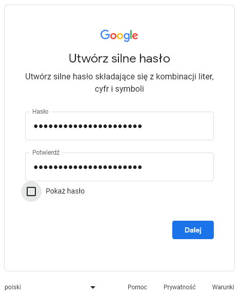
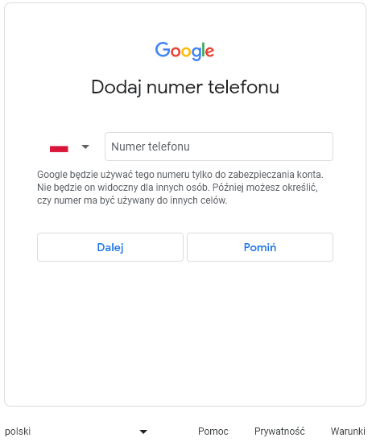
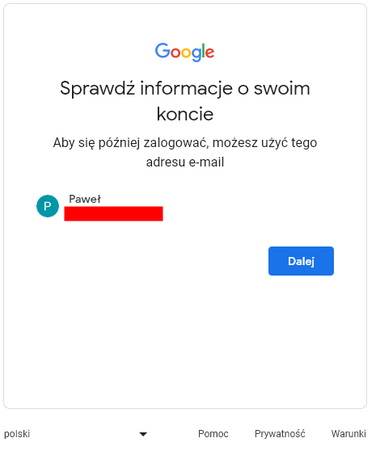
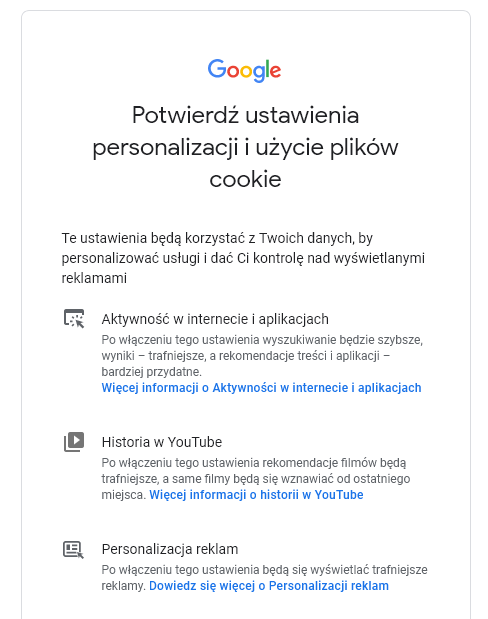

# Zakładanie konta mailowego - Gmail

Zakładanie konta mailowego na platformie **www.gmail.com** krok po kroku. Na wstępie zostaną pokazane wszystkie kroki w skrócie a nastepnie zostaną wszystkie szczegółowo opisane wraz z poglądowymi zdjęciami. 

## Kroki w skrócie:

1. Otwórz przeglądarkę internetową.
2. Przejdź na stronę główną Googla.
3. Wybierz opcję "Utwórz konto".
4. Wprowadź swoje dane osobowe.
5. Wybierz nazwę użytkownika i hasło.
6. Uzupełnij dodatkowe informacje o koncie.
7. Skonfiguruj ustawienia konta, jeśli to konieczne.
8. Zaakceptuj warunki korzystania i zasady prywatności.
9. Witaj w swojej nowej skrzynce odbiorczej!

## Szczegółowe instrukcje:

### 1. Otwórz przeglądarkę internetową:

Uruchom swoją ulubioną przeglądarkę internetową (np. Google Chrome, Mozilla Firefox, Microsoft Edge).

::: info
Poczta gmail powinna działać bez problemów na wszystkich przeglądarkach  
:::

::: danger
Jeżeli strona nie wyświetla się prawidłowo sprawdź czy masz włączone skrypy JavaScript ponieważ strona z nich korzysta.
:::

### 2. Przejdź na stronę główną Googla.

W pasku adresu przeglądarki wpisz ["www.google.com"](https://www.google.com/intl/pl/gmail/about/) i potwierdź lub kliknij na podany link. Strona główna platformy Google powinna się załadować.

### 3. Kliknij na przycisk "Utwórz konto".

Aby korzystać z gmail-a musimy stworzyć konto googla. Jest ono powiązane z działaniem naszego adresu mailowego.

::: tip
Utworzenie konta googla pozwala korzystać nam z wielu narzędzi udostepnionych wraz ze stworzeniem konta googla. W tym gmail, google sheets, google meet i wiele wiele więcej.
:::

###  4. Wprowadź swoje dane osobowe.

Po kliknięciu "Utwórz konto" pojawi nam się formularz w którym musimy wprowadzić nasze dane osobowe Imię oraz Nazwisko (opcjonalnie)

Nastepnie zostaniemy przeniesieni do kolejnego formularza który będzie od nas wymagał wprowadzenia danych takich jak datę urodzenia oraz płeć. 

Kolejnym krokiem będzie wybranie nazwy naszego adresu mailowego. Będą podane propozycje oraz mamy możliwość wprowadzenia własnej nazwy. 

### 5. Wybierz nazwę użytkownika i hasło

Następnie zostaniemy poproszeni o utwórzenie silnego hasła składającego się z kombinacji liter, cyfr i symboli

::: danger Hasło
Hasło jest bardzo ważnym elementem zabezpieczającym. Pamiętaj im trudniejsze hasło tym trudniej będzie się niepożadanym osobom włamać na twoje konto.
:::

Opcjonalnie w nastepnym kroku możemy dodać adres pomocniczy. Jest to adres, który zostanie użyty, aby skontaktować się z Tobą w razie wykrycia nietypowej aktywności na Twoim koncie lub pomóc Ci w odzyskaniu dostępu do niego.

### 6. Uzupełnij dodatkowe informacje o koncie

Opcjonalnym wyborem jest również dodanie numeru telefonu.

::: info
Google będzie używać tego numeru tylko do zabezpieczania konta. Nie będzie on widoczny dla innych osób. Później możesz określić, czy numer ma być używany do innych celów.
:::

Jednym z końcowych kroków jest sprawdzenie swoich danych.

### 7. Skonfiguruj ustawienia konta, jeśli to konieczne

Na sam koniec zostaniemy poproszeni o wybranie ustawień personalizacji. Mamy dwa wybory. 

::: tip
Warto poświęcić ustawieniom trochę czasu. Związane jest to z dopasowaniem wyświetlania treści i reklam.
:::

### 8. Zaakceptuj warunki korzystania i zasady prywatności:

Po wprowadznieu danych i wstepnym skonfigurowaniu konta potwierdzamy ustawienia personalizacji i użycie plików cookie

::: info
Google może za parę tygodni przypomnieć abyś sprawdził ustawienia.
:::

### 9. Witaj w swojej nowej skrzynce odbiorczej! 💌

Właśnie zostało utworzone twoje konto googla wraz z pocztą gmail.  

