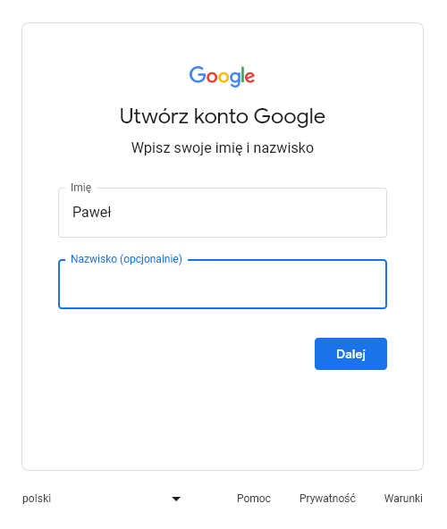
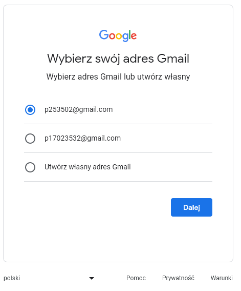

# Konto email - Gmail

Zakładanie konta mailowego na platformie **www.gmail.com** krok po kroku. Na wstepnie zostaną pokazane wszystkie kroki w skrócie a nastepnie zostaną wszystkie szczegółowo opisane wraz z poglądowymi zdjęciami. 

## Kroki w skrócie:

1. Otwórz przeglądarkę internetową.
2. Przejdź na stronę główną Googla.
3. Wybierz opcję "Utwórz konto".
4. Wprowadź swoje dane osobowe.
5. Wybierz nazwę użytkownika i hasło.
6. Uzupełnij dodatkowe informacje o koncie.
7. Zaakceptuj warunki korzystania i zasady prywatności.
8. Skonfiguruj ustawienia konta, jeśli to konieczne.
8. Witaj w swojej nowej skrzynce odbiorczej!

## Szczegółowe instrukcje:

### 1. Otwórz przeglądarkę internetową:

Uruchom swoją ulubioną przeglądarkę internetową (np. Google Chrome, Mozilla Firefox, Microsoft Edge).

::: info
Poczta gmail powinna działać bez problemów na wszystkich przeglądarkach  
:::

### 2. Przejdź na stronę główną Googla.

W pasku adresu przeglądarki wpisz ["www.google.com"](https://www.google.com/intl/pl/gmail/about/) i potwierdź lub kliknij na podany link. Strona główna platformy Google powinna się załadować.

### 3. Kliknij na przycisk "Utwórz konto".

Aby korzystać z gmail-a musimy stworzyć konto googla. Jest ono powiązane z działaniem naszego adresu mailowego.

::: tip
Utworzenie konta googla pozwala korzystać nam z wielu narzędzi udostepnionych wraz ze stworzeniem konta googla. W tym gmail, google sheets, google meet i wiele wiele więcej.
:::

###  4. Wprowadź swoje dane osobowe.

Po kliknięciu "Utwórz konto" pojawi nam się formularz w którym musimy wprowadzić nasze dane osobowe Imię oraz Nazwisko (opcjonalnie)

Nastepnie zostaniemy przeniesieni do kolejnego formularza który będzie od nas wymagał wprowadzenia danych takich jak datę urodzenia oraz płeć. 

Kolejnym krokiem będzie wybranie nazwy naszego adresu mailowego. Będą podane propozycje oraz mamy mozliwość wprowadzenia własnej nazwy. 

Wszystkie informacje na temat Tailwind dostępne są ns stronie [https://tailwindcss.com/](https://tailwindcss.com/).