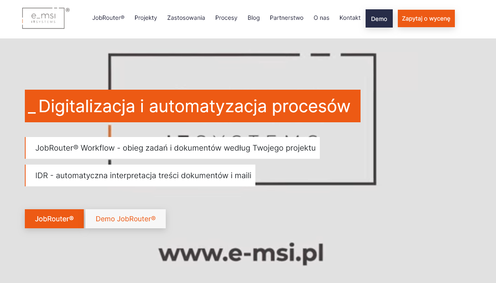
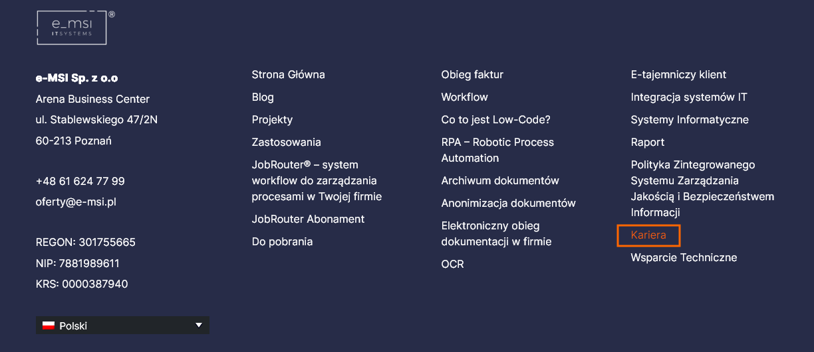
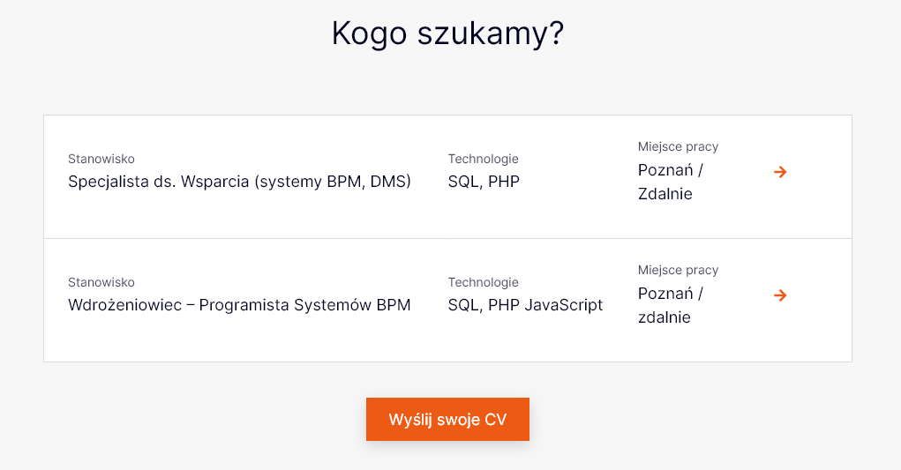
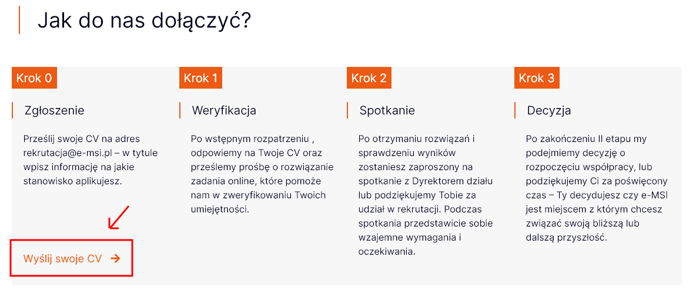
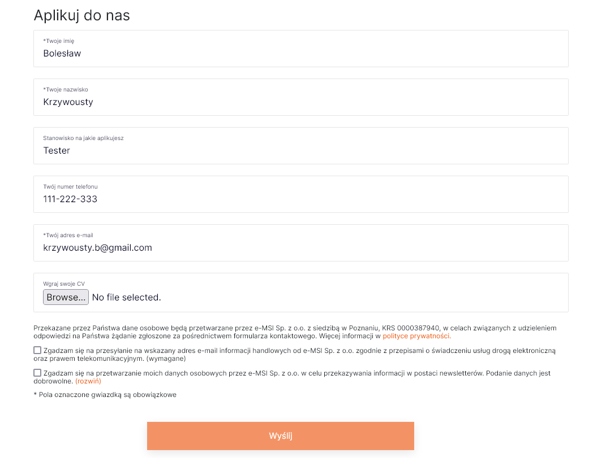
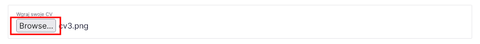
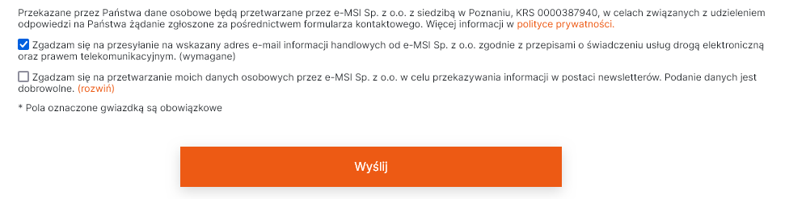

# Aplikowanie o pracę **e-msi.pl**

Aplikować o pracę za pomocą CV rozpoczynając od strony głównej https://e-msi.pl/ krok po kroku.

## Kroki w skrócie:

1. Otwórz przeglądarkę internetową.
2. Przejdź na stronę główną https://e-msi.pl/
3. Kliknij przycisk kariera w stopce strony.
4. Zapoznaj się ze ścieżką kariery.
5. Kliknij przycisk "Wyślij swoje CV"
6. Wypełnij formularz aplikacji
7. Wgraj plik ze swoim CV
8. Zaznacz wymagane zgody
9. Wyślij formularz

## Szczegółowe instrukcje:

### 1. Otwórz przeglądarkę internetową:

Uruchom swoją ulubioną przeglądarkę internetową (np. Google Chrome, Mozilla Firefox, Microsoft Edge).

::: danger Uwaga
Jeżeli strona nie wyświetla się prawidłowo sprawdź czy masz włączone skrypy JavaScript ponieważ strona z nich korzysta.
:::

### 2. Przejdź na stronę główną e-msi.pl

W pasku adresu przeglądarki wpisz ["https://e-msi.pl/"](https://e-msi.pl/) i potwierdź lub kliknij podświetlony link. Strona główna powinna się załadować.

### 3. Kliknij przycisk "kariera" w stopce strony

Przewiń na sam dół strony aż do stopki. W stopce w ostatniej kolumnie znajduje się link "Kariera" który przekieruje nas do podstrony z opisem ścieżek kariery w firmie e_msi oraz możliwością aplikowania o pracę. ["https://e-msi.pl/kariera/"](https://e-msi.pl/kariera/)

### 4. Zapoznaj się ze ścieżką kariery

Na podstronie kariery warto zapoznać się z obecnymi ofertami pracy, oferowanymi benefitami oraz ścieżką kariery.

### 5. Kliknij przycisk "Wyślij swoje CV"

Jeżeli została podjęta decyzja o aplikowaniu o pracę, mamy możliwość przejścia do formularza zgłoszeniowego w kilku miejscach. 

1. Pierwszym jest klikalny "box" z informacją "Wyślij swoje CV"

2. Drugą możliwością jest przycisk "Wyślij swoje CV" w sekcji "Kogo szukamy ?"

3. Trzecią możliwością przycisk w lewym dolnym rogu w sekcji "Jak do nas dołączyć ?"

Po kliknięciu w którąś z podanych możliwości zostaniemy przekierowani do formularza aplikacyjnego.

### 6. Wypełnij formularz aplikacji

Na tym etapie wypełniamy formularz aplikacyjny. Musimy Podać swoje Imię, Nazwisko oraz adres e-mail. Opcjonalnie możemy dodać nasz numer telefonu oraz informację na jakie stanowisko aplikujemy. 

### 7. Wgraj plik ze swoim CV

Po wpisaniu danych warto dodać swoje CV. CV możemy dodać na dwa sposoby, poprzez kliknięcie przycisku "Browse" i wybraniu odpowiedniego pliku z naszego komputera lub przeciągnięcie naszego dokumentu bezpośrednio na pole inputa.

::: info Format pliku CV
Zawsze zapisuj CV w PDF. To da Ci pewność, że dokument nie straci formatowania. Nie chcesz przecież, żeby misternie zaprojektowany życiorys stracił na wartości. Jeśli zapisz CV w formacie Word, możesz zniweczyć swoje starania o idealny format CV. 

CV w formacie PDF wygląda bardziej profesjonalnie. Musisz unikać formatów, które dają odwrotne wrażenie, takich jak JPG or PNG, PSD, INDD czy AI. Jeśli rekruter nie używa któregoś z programu graficznych, po prostu nie będzie mógł nawet otworzyć Twojego dokumentu.  
:::

### 8. Zaznacz wymagane zgody

Ostatnim etapem w formularzu jest zapoznanie się z polityką prywatności oraz potwierdzeniu wymaganych zgód na przesyłanie informacji handlowych. Po odpowiednim zaznaczeniu zdody powiniem nam sie podświetlić przycisk "Wyślij" na dole formularza który jest również informacją o poprawnym wpisaniu danych (walidacja danych).

### 9. Wyślij formularz

Klikamy przycisk "Wyślij" i nasz formularz powinien zostać wysłany. Po poprawnym wysłaniu powinna wyświetlić się informacja `"Twoja wiadomość została wysłana. Dziękujemy."` 🎉

## Źródła wiedzy

Strona główna oraz oferta [e_msi](https://e-msi.pl/).

Wszystkie informacje na temat kariery w e_msi [e_msi/kariera](https://e-msi.pl/kariera/).

